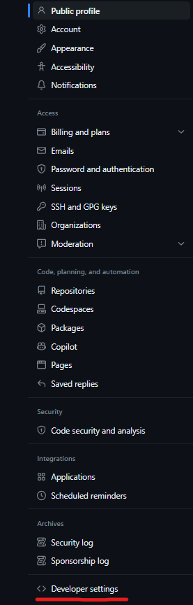
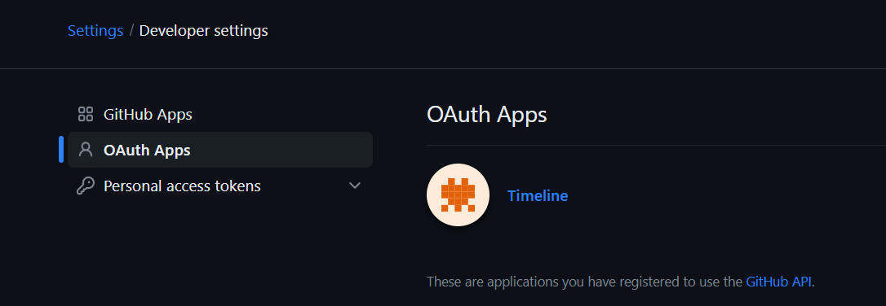
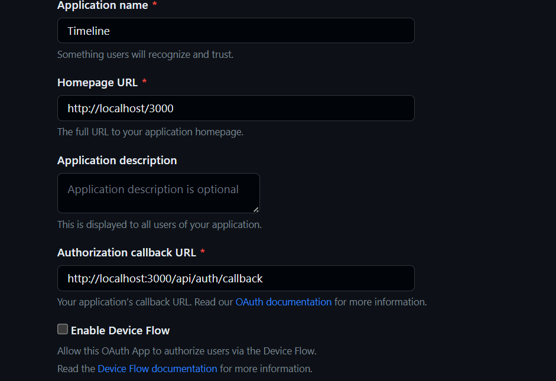

## Criar OAuth App no GitHub

1. Acessar as settings do github

2. Na aba OAuth Apps, clique em New OAuth App

3. Preencha os campos como na imagem abaixo, para definir a url da aplicação e a url de callback

4. Com o app criado, copie o client_id e o client_secret para preencher as envs de ambiente.

Pronto!